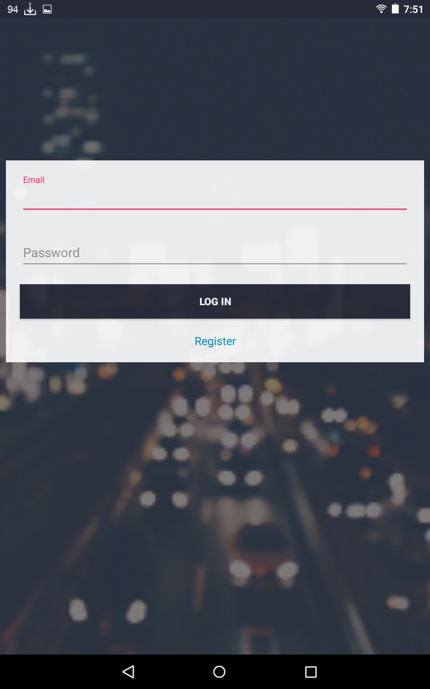
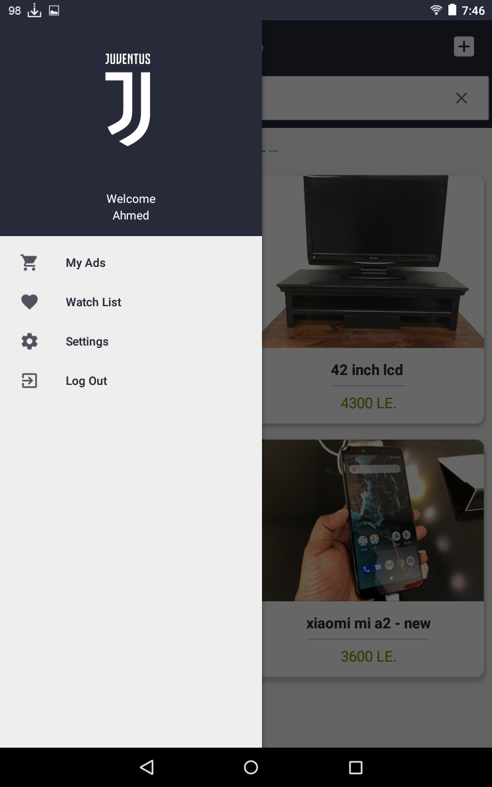
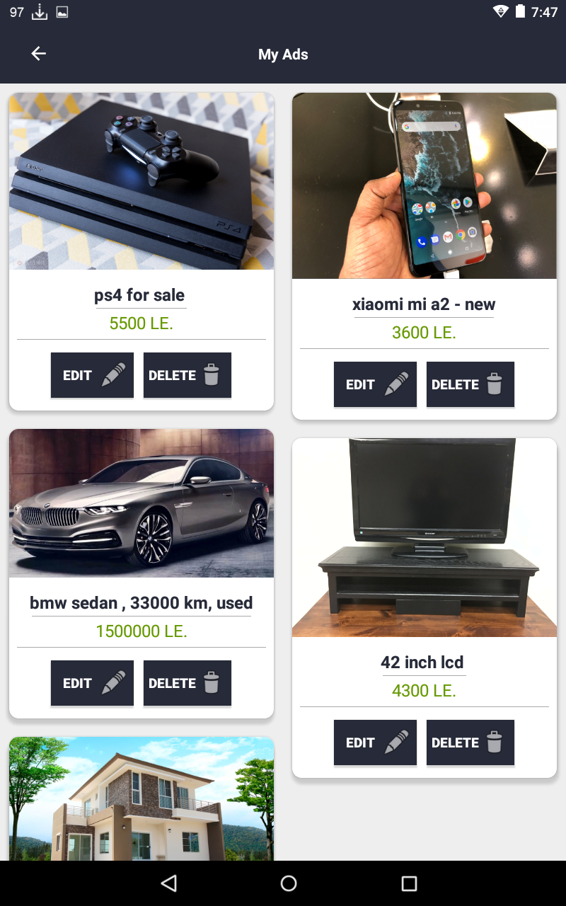

# InstaSell-Android
InstaSell connects sellers to buyers. You can sell your commercial or personal products easily. Buyers can easily browse all the products or search for a specific product.
 
 

## Features:
* Search bar to search for any product.
* Contact sellers with just one click via Email,SMS or Mobile Number.
* Add any Ad to your Favorite list to easily find it later.
* You can easily edit & delete any of your published Ads.
* Customize your account by uploading a profile picture.
* You can change your Password & Username any time.
* To keep up with new products Ads, Home Screen contains the latest published Ads.
 
 

## Screenshots:
[Play video for this App](https://www.youtube.com/watch?v=vd1fg3CYUdA)
 
 
 

 

 
 

## Libraries Used:
* [Butter Knife](https://github.com/JakeWharton/butterknife)
* [Glide](https://github.com/bumptech/glide)
* [Android View Animations](https://github.com/daimajia/AndroidViewAnimations)
* [Firebase Authentication](https://firebase.google.com/docs/auth/)
* [Firebase Realtime Database](https://firebase.google.com/docs/database/)
* [FIrebase Cloud Storage](https://firebase.google.com/docs/storage/)
 
 

## To Do:
* Creat Search Settings for accurate results like adding country & price section.
* Create Categories to classify each Ad to its corresponding category.
* Add a built-in chat system for users to contact each other with notifications.
* Add a Country & State picker in (Add a new Ad) Activity.
